# MFC

- [MFC](#mfc)
  - [Overview](#overview)
  - [Creating a Dialog-Based Application](#creating-a-dialog-based-application)
  - [Basic Controls](#basic-controls)
    - [Adding A Control](#adding-a-control)
    - [Assigning Variables](#assigning-variables)
    - [Creating Event Handlers](#creating-event-handlers)
    - [Messages (Handling Events)](#messages-handling-events)
  - [Classes For Controls](#classes-for-controls)

## Overview

MFC encapsulates the Win32 API (Application Programming Interface), a C interface to Windows OS services. It provides C++ classes which speed up Win32 application development.

It does this by encapsulating some key features of Win32 development to make them simpler and easier to use, as well as by hiding some of the more low-level aspects of programming for Windows.

There are multiple kinds of MFC application that can be created: Single Document Interface, Multiple Document Interface, and Dialog. An SDI (Single Document Interface) presents one view to the user in its window as is unable to display more than one document at a time. A good example of this is Notepad. An MDI (Multiple Document Interface) is similar to an SDI, except it can display multiple documents at once to the user, creating multiple views with distinct frames - a main frame per application, with multiple child frames. These are best suited to more complex applications.

## Creating a Dialog-Based Application

The most simple method is to use the MFC wizard to generate the boilerplate code for the project.

First, create a new MFC project using the new project dialog in VS.

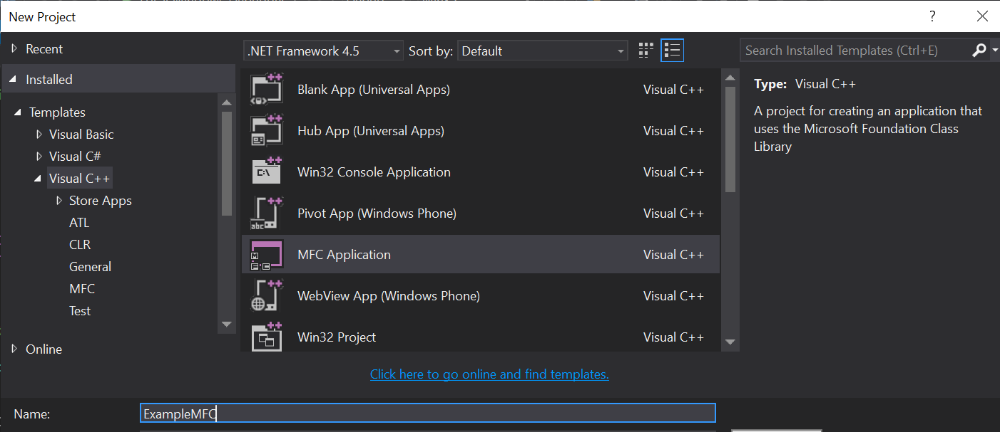

This opens the MFC Application Wizard, which will allow you to customise the MFC application it will help generate.

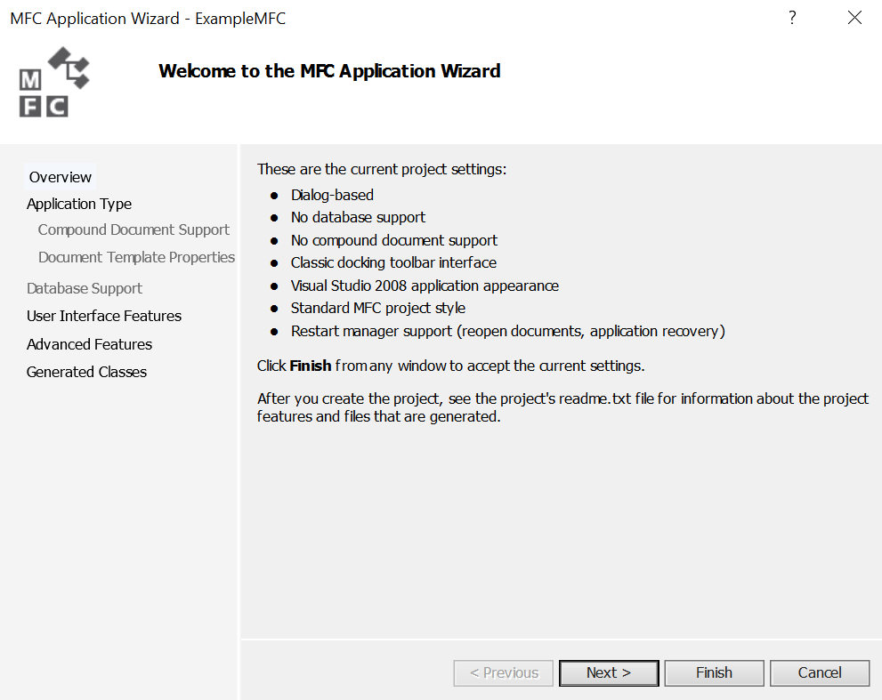

This page allows you to select the application type. In this case we are creating a dialog based application, so that option is selected. It is best to keep MFC as a shared DLL to help reduce file sizes.

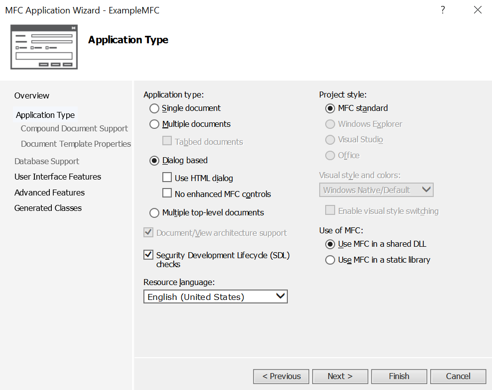

Next, you can customise the UI's Main window. Options are limited here as the application is dialog based, and in this case the defaults are okay for our purposes.


This page allows you to change the advanced features added to the project. ActiveX controls are potentially noteworthy as they are now legacy technology and should be avoided for future development.

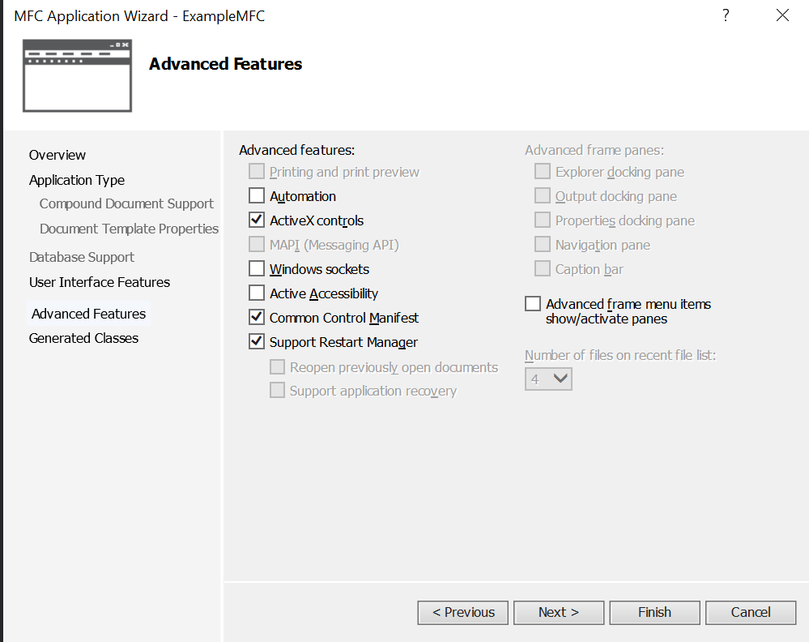

This final page will show you the generated classes and allow you to change the name before finishing. Clicking finish will close the wizard and generate the application, which will be created with a blank Dialog resource, containing a TODO message in a static text control.

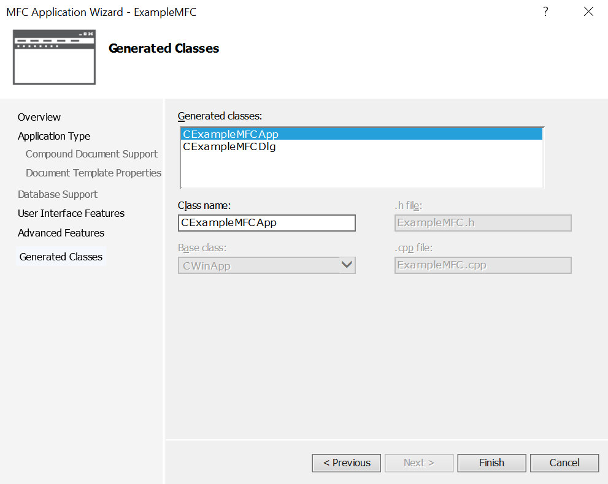

From here, the dialog can be edited and your application can be written and created.

## Basic Controls

The above instructions creates a project with a blank dialog resource, seen here:

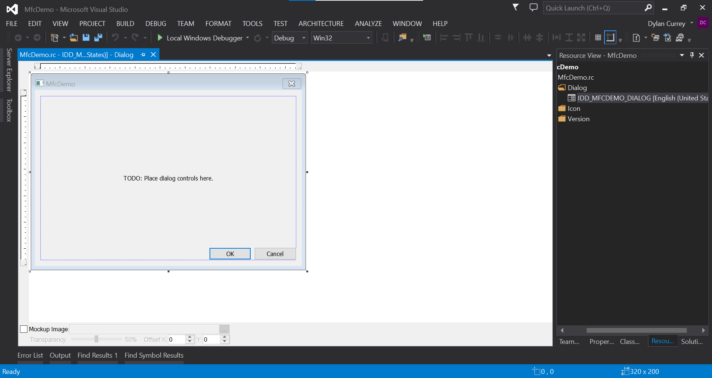

This is the dialog editor view, and allows you to add, remove and change properties of controls and the dialog itself. This is done mainly using the toolbox and properties panes (see below).

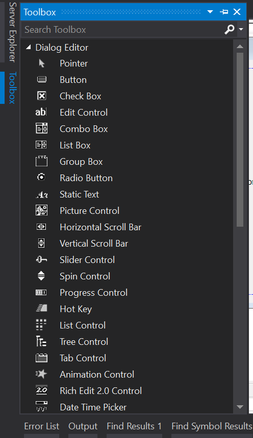
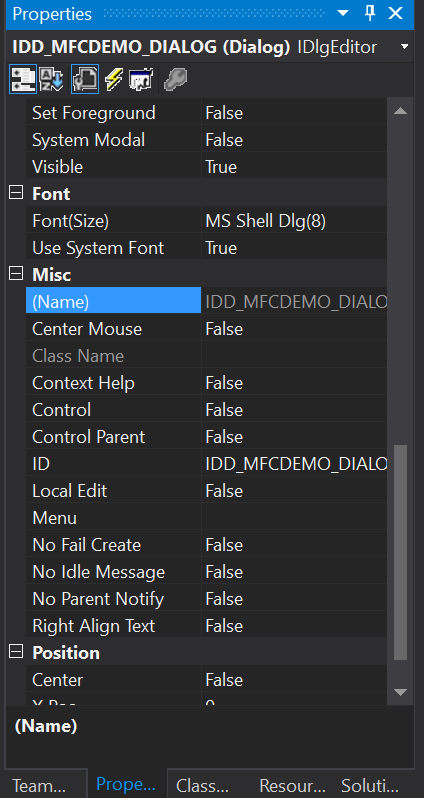

The toolbox contains numerous controls which can be placed into a dialog, noteable examples are:

- ___Static Text___ Used in order to display non user editable text in various styles.
- ___Edit Control___ Generally used to accept user input in the form of a string. Various forms of validation can be performed using this control  when creating variables using it.
- ___Button___ The generated dialog already contains two of these ("OK" and "Cancel"). These allow certain actions to be performed when clicked, though an even handler needs to be created for this.

### Adding A Control

Adding controls to the dialog is simple, just drag and drop from the toolbox, and place them where appropriate. Also, it is good practice to assign each component its own unique ID.For example:

- An example dialog may have the ID: `IDD_EXAMPLE_DLG`
- `IDC_BTN_ADD` may be a button which triggers an "add" operation.
- `IDC_V_SLIDER_BAR` may be a vertical slider.
It is important for these IDs to be relatively easy to understand as they can be used to identify resources and controls in the program.

Changing the properties of a control is also straightforward: ensure the control is selected, open the properties pane, and edit values accordingly. In the below example, the static text control's ID and caption (the text it displays) have been changed.

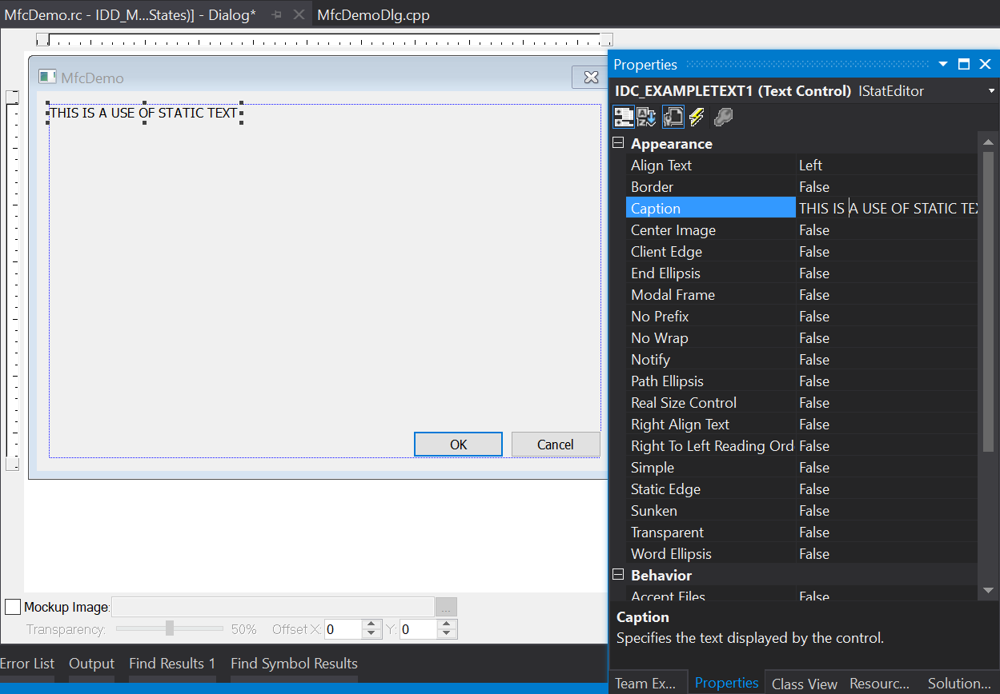

Controls have many properties, most of which are self explanatory, e.g. changing "Border" from false, to true will give the control a border. Changing the Caption will change the text it displays, changing "Align Text" will change the position of text in the control.

### Assigning Variables

Variables can be created from controls using the editor. Simply right click on a control and add a variable. You will need to decide what kind of variable you need, however.

Value variables are just that, variables for the value represented by a control. For example, the text in an edit text control, the TRUE/FALSE boolean state of a checkbox. These values are not immutable and can be set easily. Though, for changes to be represented in the GUI, `UpdateData(FALSE)` will need to be called, in order to update controls' data. Note, not all controls provide a value variable.

Variables can also be created which represent a control, not a control's value. This can be useful when a control does not support creating a variable with its value.

### Creating Event Handlers

Event handlers for controls can be created using the editor. This will create a method which is triggered when a specified event is triggered, e.g. a button is clicked. This can be done by right clicking a control and adding an event handler:

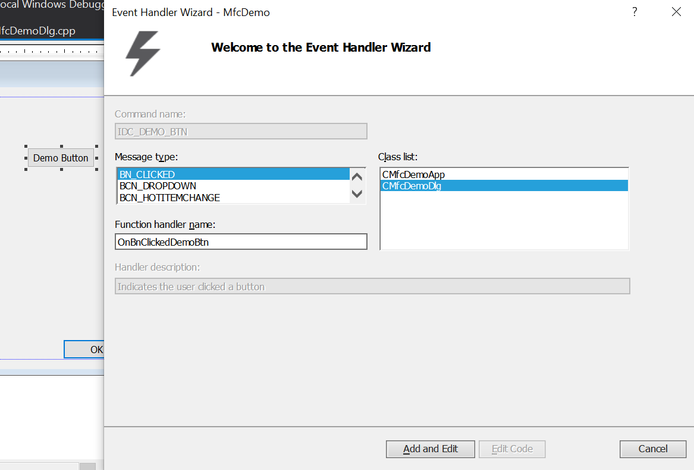

This allows an event type to be selected, and what file/class the event handling code will be created inside. In this case, as it is a button, `BN_CLICKED` is likely the most common event that will need to be dealt with, therefore will be demonstrated here.

A small function will be created:

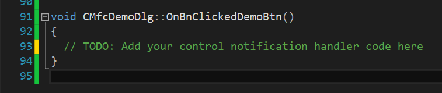

This should then be edited to handle the event, have it perform whatever action is appropriate. In this case, it will change the demo static text in the dialog box.

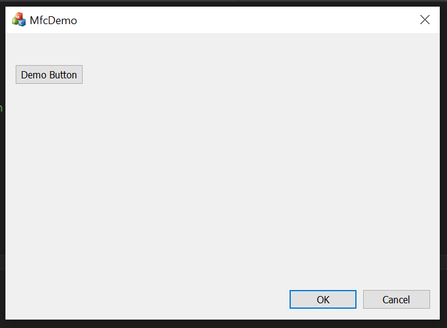

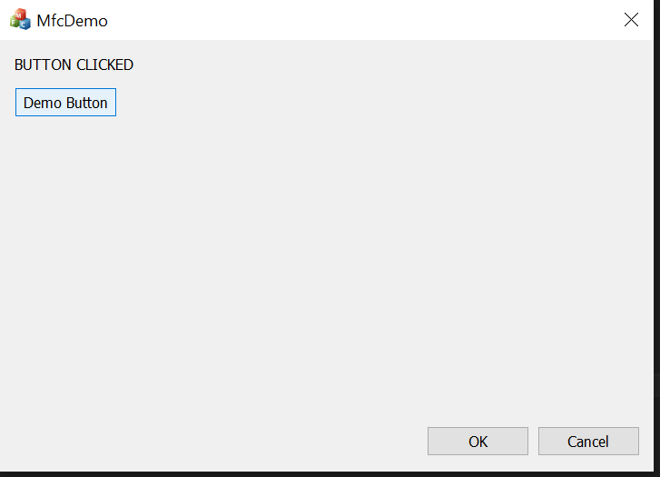

```c++
void CMfcDemoDlg::OnBnClickedDemoBtn()
{
  StaticTextDemo = "BUTTON CLICKED";
  UpdateData(FALSE);
}
```

This is a very simplistic example.

### Messages (Handling Events)

Messages (Events) are sent from the OS, often because of user action on a control, but sometimes this happens in the background. An example of this is with the timer control. This can trigger an event periodically, which can be used to run some code at a set interval. This control class is not visible in the application itself, but works in the background, sending a message to the operating system.

Similar messages can be accessed using the "Messages" section of the properties pane:

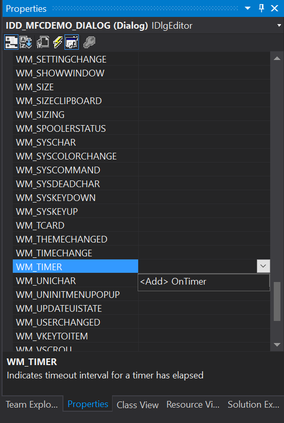

Highlighted in this case is the timer message, but note there are many messages, such as those for clicking, mouse movement etc. Using "Add" creates a stub function in a similar manner to creating events handlers for other controls. Functionality can be added from there as needed.

The below example can be used to display a simple timer using the timer, showing seconds elapsed.

```c++
void CTutorialDlgDlg::OnTimer(UINT_PTR nIDEvent)
{
  m_Seconds++;
  (m_Seconds == 1) ? m_TimerEcho.Format(_T("%d second elapsed"), m_Seconds) : m_TimerEcho.Format(_T("%d seconds elapsed"), m_Seconds);
  ...
  UpdateData(FALSE);
}
```

The messages which are handled in the program need to be declared in a message map for the dialog, which is usually all handled by the creation process.

```c++
BEGIN_MESSAGE_MAP(CMfcDemoDlg, CDialogEx)
  ON_WM_PAINT()
  ON_WM_QUERYDRAGICON()
  ON_BN_CLICKED(IDC_DEMO_BTN, &CMfcDemoDlg::OnBnClickedDemoBtn)
END_MESSAGE_MAP()
```

## Classes For Controls

