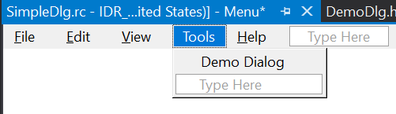
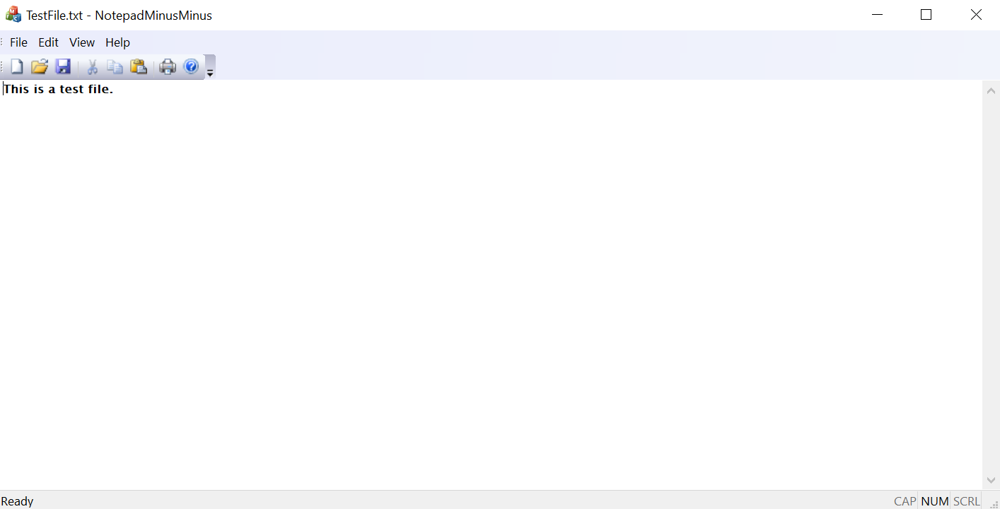

# MFC

- [Overview](#overview)
- [Conventions](#conventions)
  - [Naming Controls & Resources (IDs)](#naming-controls--resources-ids)
- [Creating a Dialog-Based Application](#creating-a-dialog-based-application)
- [Basic Controls](#basic-controls)
  - [Adding A Control](#adding-a-control)
  - [Assigning Variables](#assigning-variables)
  - [Creating Event Handlers](#creating-event-handlers)
  - [Messages (Handling Events)](#messages-handling-events)
- [Adding Classes](#adding-classes)
- [Creating a Text Editor](#creating-a-text-editor)
  - [Opening Files](#opening-files)
  - [Saving Files](#saving-files)
  - [New File](#new-file)

## Overview

MFC encapsulates the Win32 API (Application Programming Interface), a C interface to Windows OS services. It provides C++ classes which speed up Win32 application development.

It does this by encapsulating some key features of Win32 development to make them simpler and easier to use, as well as by hiding some of the more low-level aspects of programming for Windows.

There are multiple kinds of MFC application that can be created: Single Document Interface, Multiple Document Interface, and Dialog. An SDI (Single Document Interface) presents one view to the user in its window as is unable to display more than one document at a time. A good example of this is Notepad. An MDI (Multiple Document Interface) is similar to an SDI, except it can display multiple documents at once to the user, creating multiple views with distinct frames - a main frame per application, with multiple child frames. These are best suited to more complex applications.

Many functions often start 'Afx', this is because MFC was originally called AFX during development, and a lot of the original functions from this period are still in use.

## Conventions

In MFC/C++, Hungarian notation is still relatively commonplace, as it was the standard at Microsoft for some time, though has more recently fallen out of favour. Because of this, class names such as CMyEditClass, are somewhat common in MFC. Code convention such as this won't be discussed here, but it is worth keeping in mind, and the code standards and conventions you will adhere to should definitely be considered when writing MFC in a professional environment.

### Naming Controls & Resources (IDs)

The conventions for naming controls and resources with IDs are not set in stone, but below is a table containing some examples which may make code easier to read.

| Prefix  | Description |
| - | - |
| IDA | Accelerator table resource |
| IDB | Bitmap Resource |
| IDC | Control (e.g. a button. Can also be command or cursor identifier)|
| IDD | Dialog Box Resource |
| IDI | Icon Resource |
| IDM | Menu Command Identifier |
| IDR | Multiple, resources common to an application or window.|
| IDS | String Resource |
| ID | Unknown or Custom Resource|

## Creating a Dialog-Based Application

The most simple method is to use the MFC wizard to generate the boilerplate code for the project.

First, create a new MFC project using the new project dialog in VS.


This opens the MFC Application Wizard, which will allow you to customise the MFC application it will help generate.


This page allows you to select the application type. In this case we are creating a dialog based application, so that option is selected. It is best to keep MFC as a shared DLL to help reduce file sizes.


Next, you can customise the UI's Main window. Options are limited here as the application is dialog based, and in this case the defaults are okay for our purposes.


This page allows you to change the advanced features added to the project. ActiveX controls are potentially noteworthy as they are now legacy technology and should be avoided for future development.


This final page will show you the generated classes and allow you to change the name before finishing. Clicking finish will close the wizard and generate the application, which will be created with a blank Dialog resource, containing a TODO message in a static text control.


From here, the dialog can be edited and your application can be written and created.

## Basic Controls

The above instructions creates a project with a blank dialog resource, seen here:


This is the dialog editor view, and allows you to add, remove and change properties of controls and the dialog itself. This is done mainly using the toolbox and properties panes (see below).


The toolbox contains numerous controls which can be placed into a dialog, notable examples are:

- ___Static Text___ Used in order to display non user editable text in various styles.
- ___Edit Control___ Generally used to accept user input in the form of a string. Various forms of validation can be performed using this control  when creating variables using it.
- ___Button___ The generated dialog already contains two of these ("OK" and "Cancel"). These allow certain actions to be performed when clicked, though an even handler needs to be created for this.

### Adding A Control

Adding controls to the dialog is simple, just drag and drop from the toolbox, and place them where appropriate. Also, it is good practice to assign each component its own unique ID.For example:

- An example dialog may have the ID: `IDD_EXAMPLE_DLG`
- `IDC_BTN_ADD` may be a button which triggers an "add" operation.
- `IDC_V_SLIDER_BAR` may be a vertical slider.
It is important for these IDs to be relatively easy to understand as they can be used to identify resources and controls in the program. (This is explored in more detail in the [Naming Controls & Resources](#naming-controls--resources) section)

Changing the properties of a control is also straightforward: ensure the control is selected, open the properties pane, and edit values accordingly. In the below example, the static text control's ID and caption (the text it displays) have been changed.


Controls have many properties, most of which are self explanatory, e.g. changing "Border" from false, to true will give the control a border. Changing the Caption will change the text it displays, changing "Align Text" will change the position of text in the control.

### Assigning Variables

Variables can be created from controls using the editor. Simply right click on a control and add a variable. You will need to decide what kind of variable you need, however.

Value variables are just that, variables for the value represented by a control. For example, the text in an edit text control, the TRUE/FALSE boolean state of a checkbox. These values are not immutable and can be set easily. Though, for changes to be represented in the GUI, `UpdateData(FALSE)` will need to be called, in order to update controls' data. Note, not all controls provide a value variable.

Variables can also be created which represent a control, not a control's value. This can be useful when a control does not support creating a variable with its value.

### Creating Event Handlers

Event handlers for controls can be created using the editor. This will create a method which is triggered when a specified event is triggered, e.g. a button is clicked. This can be done by right clicking a control and adding an event handler:


This allows an event type to be selected, and what file/class the event handling code will be created inside. In this case, as it is a button, `BN_CLICKED` is likely the most common event that will need to be dealt with, therefore will be demonstrated here.

A small function will be created:


This should then be edited to handle the event, have it perform whatever action is appropriate. In this case, it will change the demo static text in the dialog box.


```c++
void CMfcDemoDlg::OnBnClickedDemoBtn()
{
  StaticTextDemo = "BUTTON CLICKED";
  UpdateData(FALSE);
}
```

This is a very simplistic example.

### Messages (Handling Events)

Messages (Events) are sent from the OS, often because of user action on a control, but sometimes this happens in the background. An example of this is with the timer control. This can trigger an event periodically, which can be used to run some code at a set interval. This control class is not visible in the application itself, but works in the background, sending a message to the operating system.

Similar messages can be accessed using the "Messages" section of the properties pane:


Highlighted in this case is the timer message, but note there are many messages, such as those for clicking, mouse movement etc. Using "Add" creates a stub function in a similar manner to creating events handlers for other controls. Functionality can be added from there as needed.

The below example can be used to display a simple timer using the timer, showing seconds elapsed.

```c++
void CTutorialDlgDlg::OnTimer(UINT_PTR nIDEvent)
{
  m_Seconds++;
  (m_Seconds == 1) ? m_TimerEcho.Format(_T("%d second elapsed"), m_Seconds) : m_TimerEcho.Format(_T("%d seconds elapsed"), m_Seconds);
  ...
  UpdateData(FALSE);
}
```

The messages which are handled in the program need to be declared in a message map for the dialog, which is usually all handled by the creation process.

```c++
BEGIN_MESSAGE_MAP(CMfcDemoDlg, CDialogEx)
  ON_WM_PAINT()
  ON_WM_QUERYDRAGICON()
  ON_BN_CLICKED(IDC_DEMO_BTN, &CMfcDemoDlg::OnBnClickedDemoBtn)
END_MESSAGE_MAP()
```

## Adding Classes

In order to add new elements to applications (e.g. adding a dialog box to a SDI), simply creating a new dialog box isn't enough. A class must also be created to represent the dialog in order for it to be called and to appear during execution.

Resources are created using the resources pane, right clicking and adding the appropriate item (dialog). From there, the dialog can be changed as appropriate, and the class can then be created. This is done by right clicking the dialog, selecting "Add Class" and following the prompt. Usually, no changes will need to be made, apart from to the class name.

Once the class is created, the dialog can be easily added to the program, depending on how you want it to appear. For example,



In order to make the dialog appear when this item is clicked, an event handler needs to be added to the menu, which will then create the dialog. Below is a simplistic example for displaying the dialog when the above menu item is clicked.

```c++
void CSimpleDlgView::OnToolsDemodialog()
{
  DemoDlg dlgDemo;
  dlgDemo.DoModal();
}
```

This is, fundamentally, how MFC works, with varying amounts of complexity, depending on the type of application and the controls used. Designing a UI, and handling events/messages in various ways.

## Creating a Text Editor

This guide will outline the creation of a simple text editor application, using the fundamental techniques described above. This is by no means the 'best' way to create this type of program, but should serve as an example of the creation of a working, useful MFC application.

The most straightforward way to create a simple text editor, is to use the MFC application wizard. Create an application in a similar manner to before, except changing the base class from CView, to CEdit. This will, in effect, generate a rudimentary text editor, which can open and save files:



This application has a number of issues, but can act as the foundation for a text editor, as it will in this case. From here, the code will be examined and altered where appropriate. At this point the program can save and open files, but has some issues with encoding text.

This example makes use of a few Utility Functions, contained within `UtilityFunctions.h` and `UtilityFunctions.cpp`. They are out of scope for the most part, but will be explained when appropriate.

### Opening Files

The first step to rectifying this is to implement file opening. To do this, the `OnOpenDocument` method needs to be overridden which will handle file reading in order for it to be displayed in the program. This is done by using the Class View, selecting the "...Doc.cpp" file in the project, and using properties to add an override for `OnOpenDocument`. This can also be done manually by adding the `BOOL CNotepadMinusDoc::OnOpenDocument(LPCTSTR lpszPathname)` to the file, though it is important to remember that the method is also added to the header file so it can be overridden. This process is the same when overriding any other functions.

Here is my implementation which reads the file into a vector:

```cpp
BOOL CNotepadMinusMinusDoc::OnOpenDocument(LPCTSTR lpszPathName)
{
  if (!CDocument::OnOpenDocument(lpszPathName))
    return FALSE;

  std::string filename{ toStdString(CString(lpszPathName)) };
  readLinesFromFile(m_lines, filename);

  UpdateAllViews(NULL);

  return TRUE;
}
```

This uses two of the utility functions mentioned previously: `toStdString(CString str)` and `readLinesFromFilestd::vector<std::string> lines, std::string filename)`. These are used for converting CStrings into standard strings, and for reading a specified file's lines into a vector, respectively, and are out of the scope of this document. The snippet reads the contents of the file into the class' attribute `m_lines`, then calls `UpdateAllViews(NULL)`, this tells all views which use the document to update, invalidating their contents and forcing them to redraw. This will update them to display the new data. This is done by overriding the `OnUpdate` method in the "...View.cpp" file:

```cpp
void CNotepadMinusMinusView::OnUpdate(CView* /*pSender*/, LPARAM /*lHint*/, CObject* /*pHint*/)
{
  CNotepadMinusMinusDoc* pDoc = GetDocument();
  auto lines = pDoc->GetLines();

  if (lines.size() > 0)
  {
    for (int i = 0; i < lines.size(); i++)
    {
      dispTxt += lines[i] + "\r\n";
    }
    SetWindowText(toCString(dispTxt));
  }
}
```

This gets the document from the view, and gets the document's line variable using an accessor. It returns the vector from earlier, containing the file's contents, line by line. The `OnUpdate` method may have been called by an update other than from opening a file, therefore a check is performed to ensure that a file actually has been read and the vector is populated. If the vector contains lines, the vector is iterated through, concatenating each line to a single string, separating lines with a newline value (`\r\n` in this case). This string is then converted to a CString and is used to set the window (CEdit) text.

Note, this could be potentially improved by reading from the file into a single string in the first place, eliminating the need to iterate through the vector.

Important to note is the `pDoc->GetLines();` This allows methods of an object to be called using a pointer to the object, rather than on the object itself. This is helpful in this case as this is what is returned by `GetDocument()`, which is the most straightforward way of accessing the document class.

### Saving Files

This is similarly done when saving files:

```c++
BOOL CNotepadMinusMinusDoc::OnSaveDocument(LPCTSTR lpszPathName)
{
  CNotepadMinusMinusView* view = NULL;
  POSITION pos = GetFirstViewPosition();
  if (pos != NULL) view = (CNotepadMinusMinusView*) GetNextView(pos);

  CString lines;

  view->GetWindowTextW(lines);

  saveToFile(lines, toStdString(CString(lpszPathName)));

  return TRUE;
}
```

This snippet is from the document class, and is called when the document is saved. The method usually used to save files was not suitable and caused some issues (to do with encoding, I think), and so was overridden, and replaced with this. This retrieves the view from the document class, which is a little more difficult than getting the document, and retrieves a pointer to the object using `GetFirstViewPosition` and `GetNextView`. This works as the editor is the only view belonging to the document, if this wasn't the case, this would work differently.

As before, using arrow notation the text in the window is fetched from the view. This is then saved to a file using a utility function:

```c++
void saveToFile(CString lines, const std::string& filename)
{
  std::ofstream file;
  file.open(filename);
  if (file.is_open())
  {
    file << toStdString(lines);
    file.close();
  }
}
```

This function opens a specified file (in this case, filename/path is specified by the save file dialog, which is still used as part of the saving process), and writes to it. This implementation is not perfect, but it then ensures the file is open, converts the lines from the view into a standard string (`std::string`), compatible with `ofstream`, and writes them to the file, which is then closed.

