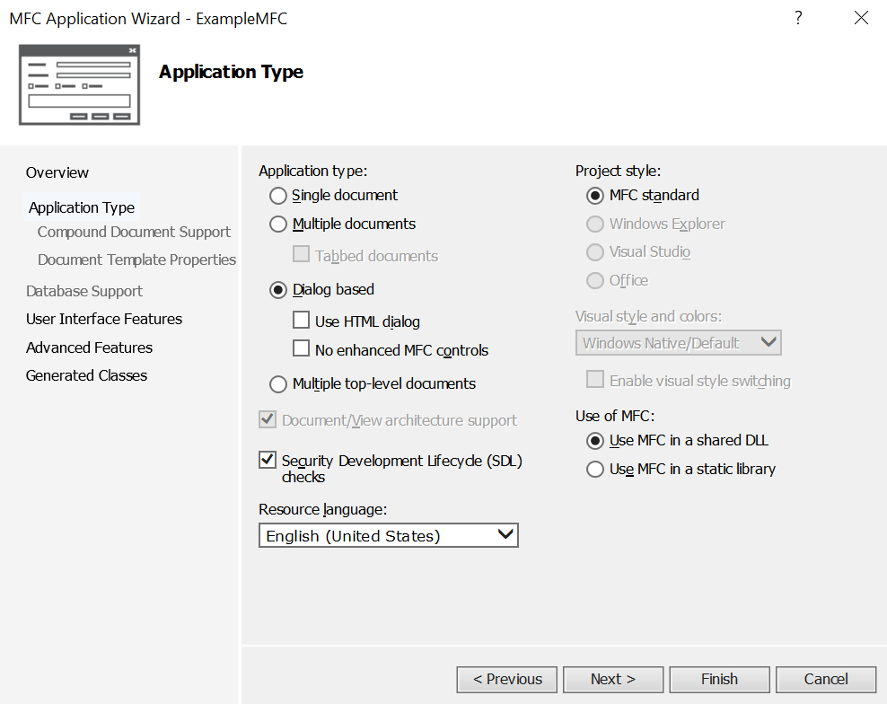

# Notes For MFC Guide
## Making Notepad (Easy setup)
- Most straightforward way to get started is to use VS wizard (new -> MFC Application, screenshot)
- Show stages of wizard, explain changes (Screenshots)
- This generates a lot of files and classes, to create a (in this case) Single Document Interface program.
- It is relatively straightforward to turn this generated program into something useful. A simple text editor, in this case.

## Overview
- [X] Encapsulates the Win32 API (Application Programming Interface), a C interface to the Windows OS services
- [X] MFC provides C++ classes to speed up Win32 development by encapsulating some of its key features and hide some of the more lower level aspects of Windows programming.
- [ ] Functions often start `Afx`, MFC was originally AFX in development, and many functions still reflect that.
- [ ] More well suited to more complex applications with multiple controls
- [ ] Allows for the creation of applications that appear to be designed for windows, using windows convention (e.g. taskbars, controls)

## Resource Files
- Resources can be composed of a number of things:
  - Interface elements (e.g. cursor, bmp, icon)
  - Menu and Dialog resources
  - Version resources
  - Custom resources
- Resource editors open appropriately depending on the kind of resource being edited.
- e.g. The dialog editor opens to edit dialog boxes, and allows for changes to be made graphically to the dialog box, as well as to help with the creating of various handler code and functions. (e.g. OnClick for buttons, OnTimer, etc. Event Handler.) 

## Creating an MFC Application
The most straightforward method is through the MFC wizards provided with VisualStudio, which generate boilerplate code for various scenarios.
- Creating an MFC Application
  - Windows Applications
  - Dialog Box based applications
  - Forms Based MFC Applications
  - File Explorer-Style Applications
  - Web Browser-Style Applications
- MFC ODBC Consume

### Creating a Dialog-Based Application
The most simple method is to use the MFC wizard to generate the boilerplate code for the project.

First, create a new MFC project using the new project dialog in VS.

This opens the MFC Application Wizard, which will allow you to customise the MFC application it will help generate.

This page allows you to select the application type. In this case we are creating a dialog based application, so that option is selected. It is best to keep MFC as a shared DLL to help reduce file sizes.

Next, you can customise the UI's Main window. Options are limited here as the application is dialog based, and in this case the defaults are okay for our purposes.

This page allows you to change the advanced features added to the project. ActiveX controls are potentially noteworthy as they are now legacy technology and should be avoided for future development.

This final page will show you the generated classes and allow you to change the name before finishing. Clicking finish will close the wizard and generate the application, which will be created with a blank Dialog resource, containing a TODO message in a static text control.

From here, the dialog can be edited and your application can be written and created.
