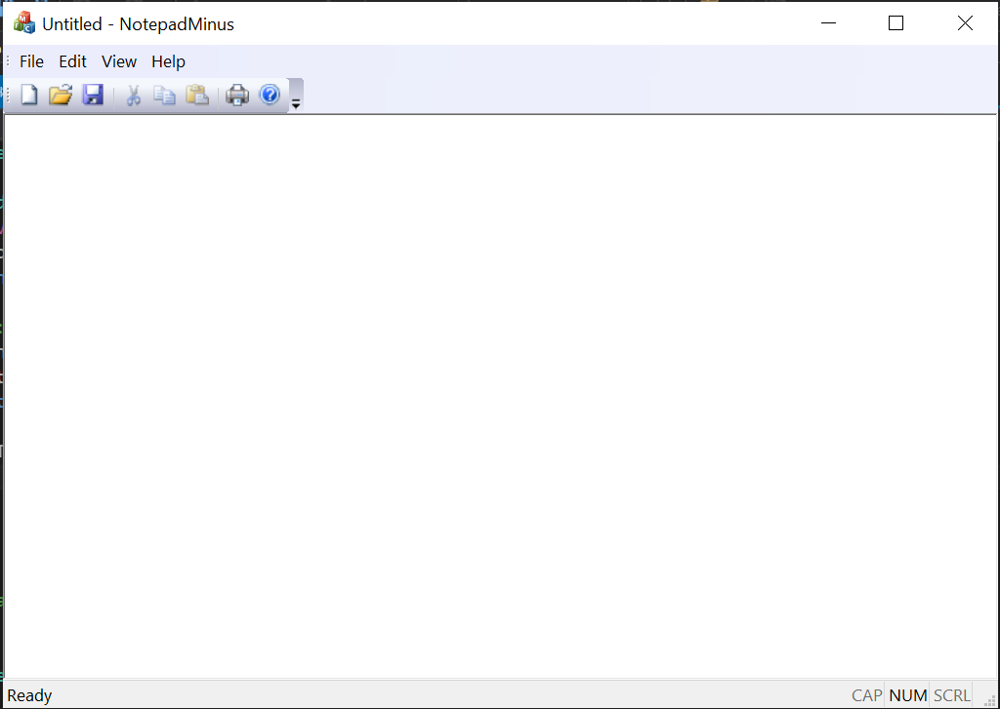

# Notes For MFC Guide

## Overview

- [X] Encapsulates the Win32 API (Application Programming Interface), a C interface to the Windows OS services
- [X] MFC provides C++ classes to speed up Win32 development by encapsulating some of its key features and hide some of the more lower level aspects of Windows programming.
- [X] Functions often start `Afx`, MFC was originally AFX in development, and many functions still reflect that.
- [X] More well suited to more complex applications with multiple controls
- [ ] Allows for the creation of applications that appear to be designed for windows, using windows convention (e.g. taskbars, controls)

## Resource Files

- Resources can be composed of a number of things:
  - Interface elements (e.g. cursor, bmp, icon)
  - Menu and Dialog resources
  - Version resources
  - Custom resources
- Resource editors open appropriately depending on the kind of resource being edited.
- e.g. The dialog editor opens to edit dialog boxes, and allows for changes to be made graphically to the dialog box, as well as to help with the creating of various handler code and functions. (e.g. OnClick for buttons, OnTimer, etc. Event Handler.).

## Creating an MFC Application

The most straightforward method is through the MFC wizards provided with VisualStudio, which generate boilerplate code for various scenarios.

- Creating an MFC Application
  - Windows Applications
  - Dialog Box based applications
  - Forms Based MFC Applications
  - File Explorer-Style Applications
  - Web Browser-Style Applications

## Notepad

Creating Notepad
SDI, with two dialogs. One to display file, one for find.

## (Content From) Creating a text editor

This guide will outline the creation of a simple text editor application, using the fundamental techniques described above. This is by no means the 'best' way to create this type of program, but should serve as an example of the creation of a working, useful MFC application.

This application makes use of a few utility functions contained in the file `NotepadMinus/UtilityFunctions.h`. These are out of the scope of this task, but may be mentioned on occasion. (e.g. the utility function for opening and reading a file into a vector).

To begin, a new project is created, this process is described previously. Create a SDI application, with all the "Advanced Frame" panes unticked/disabled, but make sure the ActiveX controls etc. are enabled. This will create various utility buttons such as 'New', 'Open', which will be useful in this application, and having the boilerplate code will save time.

For example:


This will generate a program which creates a window like this:



This is the base of the program. Text will be displayed in this window, and will be interacted with in a similar way to Notepad. From this point, Opening files was implemented first: to do this, an event handler function needs to be overridden for `OnOpenDocument` as this is the event triggered when 'Open' is clicked. This is done in a similar way to how event handlers can be added for messages. Select the class NotepadMinusDoc (the class representing the window), and override the OnOpen message handles in `Properties/Messages`:


This function needs to handle the reading of the file into the program, so it can be read and altered, here is a code snippet:

```c++
BOOL CNotepadMinusDoc::OnOpenDocument(LPCTSTR lpszPathName)
{
  if (!CDocument::OnOpenDocument(lpszPathName)) return FALSE;

  std::string filename{toStdString(CString(lpszPathName))};
  readLinesFromFile(m_lines, filename);

  // All views using CNotepadMinusDoc need to repaint
  UpdateAllViews(NULL);

  return TRUE;
}
```

This function converts the filename parameter passed by the open dialog to a standard string, because this is the type required by the file reader (this is one of the utility functions). The specified file is read into `m_lines` and all the views using this class are updated to reflect any changes in data. In this case, it's expected that the file being displayed is changed.

Next, the `NotepadMinusView` needs to be updated, so that it can actually display the file's contents once read. When a view is updated, the view is re-drawn, calling `OnDraw` again. This is where the code for displaying the text will be written.